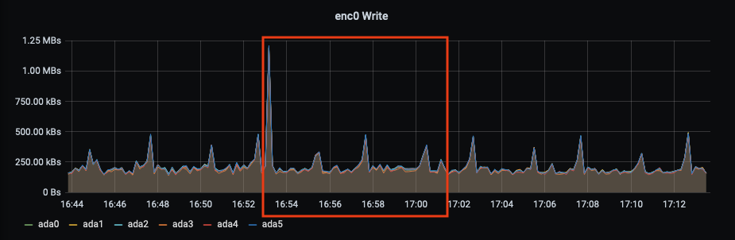

# 10 Gigabit Networking

I'm the kind of person who isn't happy until they've milked every last drop of performance out of their hardware. Back in the good ol' days that meant overclocking the snot out of my i5-4670k and my GTX 770. Every extra frame in minecraft was an unbeatable high. These days it means spending too much money on high performance hardware that I won't use.

But that doesn't mean I haven't learned some interesting things. For example: I've uncovered the 2 rules of buying expensive components:

1. The more expensive the component, the less compatible it is with other components.
1. The more reputable the brand, the harder it is to find anywhere reputable.

As an enthusiast my job is to keep these 2 rules in check with my patented shopping techniques:

1. Avoid eye contact with the Microcenter employees.
1. Say a simple chant "they aren't judging you for returning things" before walking into Microcenter
1. A single 1-star review on Amazon means it's a fake.

So with this in mind we can begin our project: 10Gb networking.

## Part 1: How the fuck do you measure disk performance?

The problem is the network connection between my Kubernetes server and Freenas server. It's a bottleneck at the standard gigabit spec. My main hard disk raidz2 array should be capable of read/write speeds in excess of 200 MB/s. I can confirm this with a simple disk test.

Here I'm writing 250,000 blocks of size 64 KB for a total of 16GB:

```bash
dd if=/dev/zero of=$DISK/output bs=64k count=250k; dd if=$DISK/output of=/dev/null; rm -f $DISK/output
```

Write results:

```bash
256000+0 records in
256000+0 records out
16777216000 bytes transferred in 4.599318 secs (3647761568 bytes/sec)
```

which confirms that write speeds are 3.39 GB/s... wait what? For a hard disk array?

The read speed results aren't finishing.

If we look at [Western Digital's Website](https://shop.westerndigital.com/products/internal-drives/wd-black-desktop-sata-hdd#WD5003AZEX) they say the read / write speeds should be... uh... wait they don't list it. Hold on. FAQ has nothing. Specifications has nothing. How is this so hard?

I found [this article](https://www.storagereview.com/review/wd-black-6tb-hdd-review) from Storage Reviews with decent samples from their disk tests. I think this gives us a potential throughput of ~175 MB/s. I can replicate using dd by writing 8192 blocks of size 2 MB for a total of 16 GB:

```bash
dd if=/dev/zero of=$DISK/output bs=2M count=8192; dd if=$DISK/output of=/dev/null; rm -f $DISK/output
```

Write results:

```bash
8192+0 records in
8192+0 records out
17179869184 bytes transferred in 4.010093 secs (3.98 GB/sec)
```

Read results:

```bash
33554432+0 records in
33554432+0 records out
17179869184 bytes transferred in 476.477611 secs (34 MB/sec)
```

Write speeds are now 4 GB/s and read speeds are 34 MB/s. The good news is I won't need an NVME SSD with write speeds that amazing. Apparently we had the technology to break the 1GB/s barrier years ago. Let's take a look at write speeds over time:

### Write



The red box indicates the time range when the test was taking place. Aside from the spike at the beginning there isn't anything to indicate disk writes are higher than normal. Let's look at read speeds over time:

### Read


Ok, one spike up to 20 KB/s at the very end. That isn't helpful. So when we were reading we didn't have any disk read activity. If our disk isn't working let's take a look at our CPU usage:


### CPU

Woah! Stuff is happening. CPU usage spikes up to 100% on one core - or 25% total usage. So for the 8 minutes our read test is running the CPU usage is high. Could this have something to do with how ZFS writes to cache first and then writes to the disk? Are reads slow because ZFS hasn't finished writing to disk?

Let's test our theory. First we'll write 1GB of 2M blocks to our disk:

```bash
dd if=/dev/zero of=$DISK/output bs=2M count=512;
```

Now we'll wait for our CPU usage to die down... it's at 0%. So writing doesn't spike our CPU at all. Even worse, our writes to disk aren't going up. So the write command doesn't seem to do anything. If we `ls -lah` our disk we see the file:

```bash
-rw-r--r--   1 root    nogroup   1.0G Jul 12 17:22 output
```

So it must be on disk. Let's run our read test:

```bash
dd if=$DISK/output of=/dev/null
```

Results:

```bash
2097152+0 records in
2097152+0 records out
1073741824 bytes transferred in 24.645694 secs (43567117 bytes/sec)
```

24 SECONDS to **READ** 1GB of data! **WHAT??** How is this possible? Maybe our test is bad. Does this have something to do with compression? Is it because /dev/zero is completely compressible? Let's try with 1 GB /dev/urandom instead.

```bash
dd if=/dev/urandom of=$DISK/output bs=16G count=1
```

Results:

```bash
1+0 records in
1+0 records out
1073741824 bytes transferred in 6.126579 secs (167 MB/sec)
```

Woah! That's way more reasonable! 167 MB/s write speeds are about what we'd expect. Let's try our disk test again with 16 GB of 2 MB blocks:

```bash
dd if=/dev/urandom of=$DISK/output bs=2M count=8192; dd if=$DISK/output of=/dev/null; rm -f $DISK/output
```

Write Results:

```bash
8192+0 records in
8192+0 records out
17179869184 bytes transferred in 100.549431 secs (162 MB/sec)
```

Read Results:

```bash
33554432+0 records in
33554432+0 records out
17179869184 bytes transferred in 67.437209 secs (242 MB/sec)
```

That's way better. Let's check our graphs:

### Write


### Read


### CPU


Oh yeah, now we're getting somewhere. So our disk speed when writing 2 MB blocks is around 162 MB/s and our read speed is around 242 MB/s. That means that my network connection *is* bottlenecking my disk reads and writes. Remember that a 1 gigabit connection is only capable of ~100 MB/s on a good day. We really are missing out on some performance.

## Part 2: How the fuck do you find a good network card?

I went to Microcenter. I didn't do any research ahead of time and I didn't look at reviews. I picked out the nicest looking 10g network card they had - an ASUS 10G NET ADP PCI-E RJ-45, pictured below:


I paid $99.99 (not including tax) which put it at "reasonable" for 10g network adapters. It advertised Windows 7, 8, 8.1, 10, and Linux kernel 3.2, 3.6, 4.2, and 4.4 compatibility and assured me that its "built-in QOS technology" would make my traffic faster. Great! Let's install it!

Except you can't. You see I forgot rule #1: more expensive hardware is less compatible. And while this card may have been compatible with the Linux kernel it **was not** compatible with FreeBSD. That's ok, Microcenter's generous return policy means that I can just swap out for a different card. Enter: the  Trendnet 10 Gigabit PCIe Network Adapter, pictured below:


I paid 109.99 (not including tax) which put it at "still reasonable" for 10g network adapters. It's ugly and small but it's got it where it counts, right? This one also advertised Windows integer and Linux Kernel float compatibility just like the Asus card. But wait! This card also says that it supports **jumbo packets** to make your network **EVEN FASTER**. What are we waiting for? Let's plug it in!

Hmm, same issue. It's detected as a PCI device but not showing up as a network interface. Well maybe I can enable unsupported hardware? Maybe I can compile the Windows 7 driver using FreeBSD's bizarre driver compiler that supports Windows XP drivers and turns them into FreeBSD drivers? Maybe I can return this stupid card to Microcenter?

So I returned the stupid card to Microcenter almost defeated. But then, out of the corner of my eye I noticed something: an intel x520-DA2 SFP+ network card on sale for $130. There was only one available and it was a test product so they wouldn't be getting any more in. Should I risk it? I don't have any [SFP+ hardware](https://en.wikipedia.org/wiki/Small_form-factor_pluggable_transceiver) and it's notoriously expensive but come on, I have to get this to work!

With the intel card in hand I left the store head held high. This will work.

Except I don't have an SFP+ network cable. [Back to Microcenter](https://www.microcenter.com/product/624481/ubiquiti-networks-unifi-sfp-dac-patch-cable-16-ft).

Except I don't have an SFP+ receiving card. I need an RJ45 adapter. [Back to Microcenter](https://www.microcenter.com/product/621166/ubiquiti-networks-uf-rj45-10g-sfp-to-rj45-coppermodule).

Except Intel locks down their SFP+ cards to only work with their cables and adapters. Time to [enable unsupported hardware](https://community.ui.com/questions/Can-I-use-Ubiquity-SFP-modules-in-Intel-PCI-cards/917d7de4-4fcc-4d3f-875a-72c222ae2135#answer/599001b1-4549-441f-b879-1606d1d9b216).

Except the card **still doesn't support the rj45 adapter**. Fine. Returned to Microcenter. That's like the 3rd return in 2 days I'm gonna be on a list.

What do the forums have to say?

Oh, the forums get mad at you for not checking the FreeBSD hardware compatibility list. Let's just check that out by heading to FreeBSD's [**fucking book**](https://www.freebsd.org/doc/en/books/) of documentation.

[Start here](https://www.freebsd.org/doc/en/books/faq/hardware.html) and read why FreeBSD reports less than 4GB of memory when installed on an i386 machine.

[Click '4.3. Peripherals'](https://www.freebsd.org/doc/en/books/faq/compatibility-peripherals.html) and be taken to a page with almost nothing on it.

[Click 'What kind of peripherals does FreeBSD support?'](https://www.freebsd.org/doc/en/books/faq/compatibility-peripherals.html#idp45808888) oh wait it's the only section in this chapter and you're already there.

[Click '12.1'](https://www.freebsd.org/releases/12.1R/hardware.html) and be taken to the ENTIRE SUPPORTED HARDWARE PAGE.

<kbd>ctrl</kbd> + <kbd>F</kbd> and search for "network" in an attempt to find network cards. Oh wait, network is literally everywhere.

Check the table of contents:


useful.

Click "supported devices" - notice that it starts with "Disk Controllers" and there's no sub table of contents so you're gonna have to scroll (but not too fast or you'll miss it) until you see the ethernet adapters. But ok, this is actually pretty good. I can at least cross reference a product here. Let's find a 10 gigabit adapter.

Oh wait, they don't have them ordered by speed. Maybe we search for 10g? Actually that returns a ton of results. There has got to be a better way.

So after duckduckgo-ing "Best 10 gigabit adapter for Freenas" and then immediately googling "Best 10 gigabit adapter for Freenas" I found [this post](https://www.servethehome.com/buyers-guides/top-hardware-components-freenas-nas-servers/top-picks-freenas-nics-networking/): a recommended list of support NICs for freenas. I scrolled down to the 10GbE (10Gbase-T) section and reaped my bounty.

1. Best: Chelsio T520-BT: $285.51
1. Good: Intel X550-T2: $301.91
1. Good: Chelsio T420-BT: ???
1. Good: Intel X540-T2: $189.88

Holy shit that's expensive. For **one card** I'm going to pay $300?? That's insane! I guess the intel x540-T2 is cheapest. Let's take a look at that one. Oh hey, they make an x540-T1 variant with only 1 ethernet port and it's significantly less expensive! $137.57 on Amazon. I'll take 2!

Three days later my 2 10 gigabit network cards arrived in "ok" packaging. They were loose in the box with no protective bubble wrap or air pockets but at least they were in a box. I guess they could have put them in an envelope.

I opened both up.

## Part 3: What the fuck is your plan?

Connect my Kubernetes server directly to my Freenas server. Assign both an IP address and let them talk over that sweet sweet 10 gigabit interface. Expected speeds of 1 GB/s will blow past my estimated disk read and write speeds. Finally I can unleash the full power of my mechanical hard drives.

[iperf3](https://iperf.fr/) is a great tool for testing network speeds. It's also one of those tools with [documentation that isn't actually documentation](https://software.es.net/iperf/). Good luck sorting that out. After the FreeBSD book of truth I was done with confusing hyperlinked web pages.

I found [this post](https://www.ictshore.com/networking-fundamentals/how-to-use-iperf/). Admittedly it's about using iperf3 on Windows but it still gives you the basic commands you need to get started. Have one server listening and the other server connecting as a client. The client sends data to the server and they both measure throughput. Awesome! iperf is genuinely a great tool.

Except when it reveals the horrible horrible truth: you don't know what you're doing.

Here are the speed results when my kubernetes server acts as the client and sends data to the freenas server:

```bash
[ ID] Interval           Transfer     Bitrate         Retr
[  5]   0.00-10.11  sec  10.8 GBytes  9.17 Gbits/sec  36975             sender
```

Ok... That's a great Bitrate but that's a lot of Retries. Let's try the freenas server as the client sending data to the Kubernetes server:

```bash
[ ID] Interval           Transfer     Bitrate         Retr
[  5]   0.00-10.00  sec  1.39 GBytes  1.19 Gbits/sec   88             sender
```

**SOBS IN ANGER**

Why is it not 10Gbit??? What happened.

Well my friends, this is what I like to call a server bottleneck. I have a theory that my 2014 freenas hardware might be struggling to send data fast enough to my 2020 kubernetes hardware. I have a "Vogzone for Intel x540-T2" on the way to test further As for now, 10 gigabit is expensive, annoying to configure, and seems to only work on more recent hardware.

10/10 I highly recommend.

**EDIT:** [Part 2 is out!](10gig2.md)