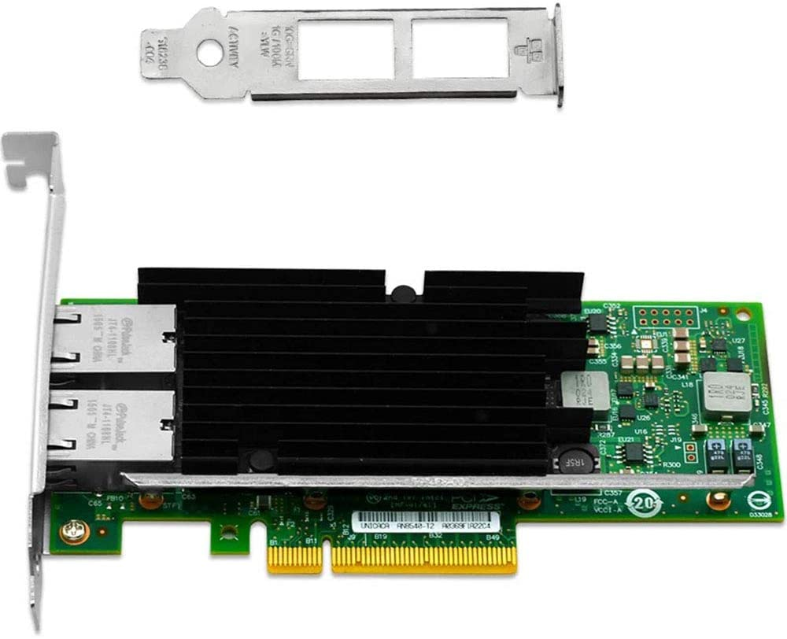
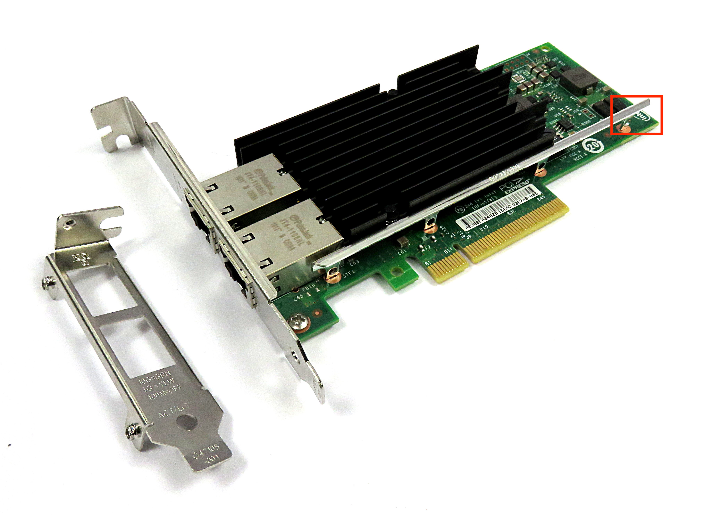
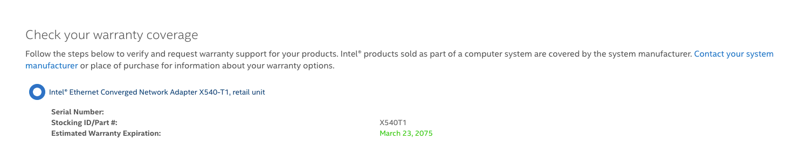

# 10 Gigabit Networking pt 2

## Part 1: Who the fuck is Vogzone?

It arrived! The [Vogzone for Intel X540-T2 10GB Ethernet Converged Network Adapter](https://www.amazon.com/gp/product/B07F8RM56G/ref=ppx_yo_dt_b_asin_title_o01_s00?ie=UTF8&psc=1) (pictured below). 



I haven't been this excited for a network card since I bought and then immediately returned the Intel x520-DA2 to Microcenter. Shipped and sold by [Vogzone](https://www.amazon.com/stores/Vogzone/page/B3DB89D1-C324-4CD4-9F6C-47C1ABB3A2C9?ref_=ast_bln) it sports an "original x540 controller chip" and should be capable of 2 simultaneous 10 gigabit connections. Wait... so this isn't an Intel OEM card?

Lemme explain.

If you Google "Vogzone" you'll get a link to the seller homepage on Amazon and a bunch of other links ([mostly dead](https://www.canterburywoods.org/Chipset-PCIE-X8-NIC-Computers-&-Accessories-Vogzone-for-Intel-X540T2-10GB/352903.htm)) to various internet retails stores offering market space for Vogzone. They seem to be a reseller of Intel network cards. The cards definitely aren't genuine intel, notice the missing "Intel" logo in the bottom right, compare to a real card:



But they also claim to have a genuine intel x520 chipset. Let's compare my 2 cards. On top is my genuine Intel x540-T1. On the bottom is the Vogzone maybe-fake x540-T2:


Ok, so far so good. They look *really* similar. Let's take a look at the back:


Nothing unusual here. Similar layout to the T1 actually. So as far as I can tell Vogzone is either a really good knockoff manufacturer or they buy genuine Intel chipsets and build the boards themselves. This would be similar to a graphics card manufacturer buying Nvidia's latest chip and producing their own board - a very common thing. Let's plug it in.

Alright! So booting my Kubernetes server with the card in didn't cause any explosions. Let's check out network interfaces:

```bash
ip link show
```

Returns:

```bash
1: lo: <LOOPBACK,UP,LOWER_UP> mtu 65536 qdisc noqueue state UNKNOWN mode DEFAULT group default qlen 1000
    link/loopback 00:00:00:00:00:00 brd 00:00:00:00:00:00
2: eth0: <BROADCAST,MULTICAST,DYNAMIC,UP,LOWER_UP> mtu 1500 qdisc mq state UP mode DEFAULT group default qlen 1000
    link/ether 9c:69:b4:61:9b:24 brd ff:ff:ff:ff:ff:ff
3: eth1: <NO-CARRIER,BROADCAST,MULTICAST,DYNAMIC,UP> mtu 1500 qdisc mq state DOWN mode DEFAULT group default qlen 1000
    link/ether 9c:69:b4:61:9b:25 brd ff:ff:ff:ff:ff:ff
4: eth2: <BROADCAST,MULTICAST,DYNAMIC,UP,LOWER_UP> mtu 1500 qdisc mq state UP mode DEFAULT group default qlen 1000
    link/ether a8:a1:59:06:e8:b5 brd ff:ff:ff:ff:ff:ff
5: eth3: <NO-CARRIER,BROADCAST,MULTICAST,DYNAMIC,UP> mtu 1500 qdisc pfifo_fast state DOWN mode DEFAULT group default qlen 1000
    link/ether a8:a1:59:06:e8:b3 brd ff:ff:ff:ff:ff:ff
6: wlan0: <BROADCAST,MULTICAST> mtu 1500 qdisc noop state DOWN mode DEFAULT group default qlen 1000
    link/ether 50:eb:71:10:94:10 brd ff:ff:ff:ff:ff:ff
```

That's a good sign! I have 4 ethernet interfaces! Even better: eth0 and eth2 are UP! Maybe this **is** a genuine intel card! Let's check out PCI devices:

```bash
lscpi -mk
```

Returns:

```bash
03:00.0 "Class 1300" "1022" "1485" "1022" "1485"
23:00.1 "Class 1080" "1022" "1486" "1022" "1486" "ccp"
60:07.0 "Class 0600" "1022" "1482" "0000" "0000"
20:00.0 "Class 0600" "1022" "1480" "1022" "1480"
60:00.2 "Class 0806" "1022" "1481" "1022" "1481"
00:08.0 "Class 0600" "1022" "1482" "0000" "0000"
20:08.1 "Class 0604" "1022" "1484" "1022" "1484" "pcieport"
42:04.0 "Class 0604" "1022" "57a3" "1022" "1453" "pcieport"
00:18.3 "Class 0600" "1022" "1493" "0000" "0000" "k10temp"
40:05.0 "Class 0600" "1022" "1482" "0000" "0000"
43:00.0 "Class 0c03" "1b21" "3242" "1b21" "3242" "xhci_hcd"
20:03.0 "Class 0600" "1022" "1482" "0000" "0000"
4c:00.0 "Class 1300" "1022" "1485" "1022" "1485"
...
```

Ok that's unreadable. What am I looking for anyway? Let's do some more research.

Googling for "Check if intel card is real" returns the intel website and a bunch of useful links. But if you dig far enough you'll find [this](https://supporttickets.intel.com/warrantyinfo?lang=en-US), a website to check your warranty coverage. Let's try with a genuine card:



Nice! That's a... really long warranty. Is it really going to last that long? Ok, let's try checking on the Vogzone card:

Wait, I don't have a serial number. I also don't have a part number. I don't have any of the numbers my Intel card had. So this is not an original card at all! But it showed up just fine so it must have working chipset. Let's run a speed test:

```bash
iperf3 -c mainframe -R
```

Results:

```bash
[ ID] Interval           Transfer     Bitrate         Retr
[  5]   0.00-10.10  sec  10.7 GBytes  9.13 Gbits/sec  57732             sender
```

Woo! That's a fast card! So we confirmed that it **is** a genuine 10g card. And based on the compatibility (which you can read more about [here](10gig.md#)) it must be a genuine intel chipset or something close to it. That's probably good enough for me - although I'd recommend finding a genuine reseller.

Based on this circumstantial evidence I'd say that Vogzone uses genuine Intel chipsets and manufactures their own board. They seem to be decent quality and are [even sold at walmart (?)](https://www.walmart.com/ip/Vogzone-for-Intel-X520-DA2-X520-SR2-10GbE-Converged-Network-Card-Dual-SFP-Port-PCI-E-X8-with-Intel-82599ES-Chip/441802314) so I'd say it's good enough for me.

## Part 2: Does it fucking work?

I have a confession to make. I didn't need this card. I just wanted it for a test. At the end of [part 1](10gig.md) I had a theory that my freenas server was struggling to send data at 10 gigabit to my Kubernetes server because of it's old hardware. The only way to test that theory is with a another computer - my gaming PC. It sports an intel 6800K, 16 GB of crucial cheapo ram, a 1TB Samsung PCI SSD, an nvidia 980TI, and a **pathetic** gigabit ethernet adapter.

The important thing is it's way more powerful than my freenas server with its intel i5-4670k. Could I have tested this without spending $200 on a probably-fake card? Fuck off with your questions.

Let's install the card. I do need a CAT 6A ethernet cable that reaches from my PC to my server. I literally have 1 cable long enough for that - I must make a trip to Microcenter.

Once in Windows I can configure my network card. I can open "Network Connections" and edit `Slot04 x 16` (good job with naming that Windows) and add a static IP address on the same subnet as my server's eth1 adapter. Then I can flip back to my server and use ip to assign a static IP to my card:

```bash
ip addr add 6.0.23.1/24 dev eth1
ip link set dev eth1 up
```

Then I can ping my Windows machine:

```bash
ping 6.0.23.2
```

Results:

```bash
PING 6.0.23.2 (6.0.23.2): 56 data bytes
64 bytes from 6.0.23.2: seq=0 ttl=128 time=0.487 ms
64 bytes from 6.0.23.2: seq=1 ttl=128 time=0.333 ms
```

As expected both cards talk to eachother with no problems. Let's run iperf3!

On my windows machine I ran:

```bash
iperf3 -c 6.0.23.1
```

Results:

```bash
[ ID] Interval           Transfer     Bandwidth
[  4]   0.00-10.00  sec  3.23 GBytes  2.78 Gbits/sec                  sender
```

Ok what the fuck. So when the Windows machine is the client I'm getting 2.78 Gbits/sec. Granted, that's much better than the 1.19 Gbits/sec that my Freenas server got when it was the client. What about when the Windows machine is the server:

```bash
iperf3 -c 6.0.23.1 -R
```

Results:

```bash
[ ID] Interval           Transfer     Bandwidth       Retr
[  4]   0.00-10.00  sec  8.41 GBytes  7.23 Gbits/sec   92             sender
```

This is terrible! What's going on?

My first thought is that Windows is bad at sending network data. Let's tweak some settings. First I'll enable jumbo packets - I have no idea if this'll help but it's worth a shot.

Same results.

Now I'm going to set transmit buffers to maximum - 16,384, receive buffers to maximum - 4,096, and maximum number of RSS queues to maximum - 16. This should do something.

Same results.

Maybe my cable is bad? I'll try a CAT 7 cable instead.

```bash
[ ID] Interval           Transfer     Bandwidth       Retr
[  4]   0.00-10.00  sec  8.30 GBytes  7.13 Gbits/sec  106             sender
```

Ok that got worse. My speeds *are* technically better though.

## What the fuck is your plan?

Return the network card! Clearly that didn't work. For now I'm settling for slow read speeds from my NAS. I'll need something more powerful to test any further and I definitely don't have room on my credit card to float that. I'll write a part 3 if I ever get full 10 gigabit speeds working.

10/10 I highly recommend.
