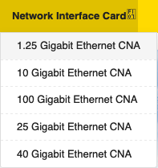
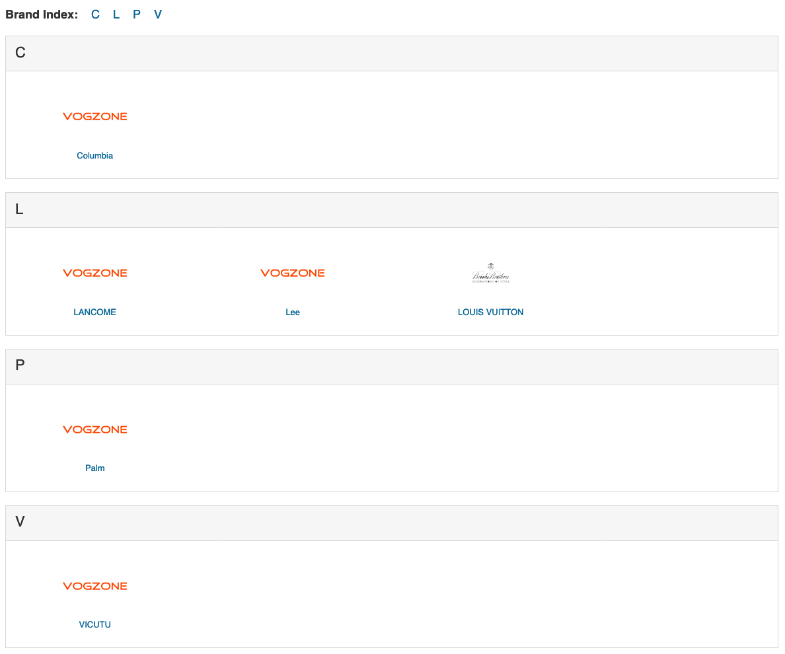

# 10 Gigabit Networking pt 2

If you haven't read [part 1](10gig.md) I highly recommend it. Here's a quick recap:

Last week on "What the Fuck?": Our hero sobbed long into the night because his 10 gigabit network cards only hit 10 gigabit speeds in one direction. He wanted to connect his Windows PC to his server with a 10gb connection without buying a 10gb network switch. After browsing Amazon he found [Vogzone](https://www.amazon.com/gp/product/B07F8RM56G/ref=ppx_yo_dt_b_asin_title_o01_s00?ie=UTF8&psc=1) and ordered an X540-T2 10gb ethernet adapter.

Will this solve all his problems or will he shamelessly return more hardware? Find out now on...

## Part 1: Who the fuck is Vogzone?

It arrived! The [Vogzone for Intel X540-T2 10GB Ethernet Converged Network Adapter](https://www.amazon.com/gp/product/B07F8RM56G/ref=ppx_yo_dt_b_asin_title_o01_s00?ie=UTF8&psc=1) (pictured below). 


I haven't been this excited for a network card since I bought and then immediately returned the Intel x520-DA2 to Microcenter. Shipped and sold by [Vogzone](https://www.amazon.com/stores/Vogzone/page/B3DB89D1-C324-4CD4-9F6C-47C1ABB3A2C9?ref_=ast_bln) it sports an "original x540 controller chip" and should be capable of 2 simultaneous 10 gigabit connections. Wait... so this isn't an Intel OEM card?

Lemme explain.

If you Google "Vogzone" you'll get a link to the seller homepage on Amazon and a bunch of other links ([mostly dead](https://www.canterburywoods.org/Chipset-PCIE-X8-NIC-Computers-&-Accessories-Vogzone-for-Intel-X540T2-10GB/352903.htm)) to various internet retail stores offering market space for Vogzone. They seem to be a reseller of Intel network cards.

If you Google "Vogzone wiki" you'll get nothing. They don't have a wiki page and are therefore not a real company.

## Part 1.5: Bing is fucking better than Google?

If you **Bing** "Vogzone" you'll get a mysterious link that doesn't appear in Google's top search results: [vogzone.com](http://vogzone.com/). Vogzone.com sheds a little light on the mystery: they are a Chinese manufacturer or reseller of computer equipment.

Let's dig into this responsive php website. The first thing I did was hover over "Network Interface Card":



100 Gigabit Ethernet CNA!!! I bought the wrong card, let's go straight to 100 gigagbit! Except [there are no products in this category](http://www.vogzone.com/index.php?route=product/category&path=59_64). There also aren't products in [40 gigabit](http://www.vogzone.com/index.php?route=product/category&path=59_63) or [25 gigabit](http://www.vogzone.com/index.php?route=product/category&path=59_62).  Ok, so 10 gigabit is their max. Why bother listing the other options? Probably because this site is "Powered By Sankezhu Trading Co" and is likely a clone of another site.

I'm not just guessing either. Take a look at their [brands](http://www.vogzone.com/index.php?route=product/manufacturer) section. This **computer parts reseller/manufacturer** also sells Columbia, Lancome, Lee, Palm, and my favorite, Louis Vuitton.



The [Louis Vuitton](http://www.vogzone.com/sony) link actually redirects to vogzone.com/sony, which their nginx server reports as "404 not found". So if you wanted a Louis Vuitton playstation you're out of luck. I'm dissapointed.

## Back to Part 1: Who the fuck is Vogzone?

The cards definitely aren't genuine intel, Let's compare my 2 cards. On top is my genuine Intel x540-T1. On the bottom is the Vogzone maybe-fake x540-T2:


Notice the missing "Intel" logo in the bottom right. You can't see it here but the serial number is completely different. The heat sink is slightly beefier (maybe a good thing) on the Vogzone card adn the edges of the PCB are slightly more rounded. The overall quality of the card seems higher for the Vogzone but the components on the Intel card *look newer*. Not sure if this is my imagination.

Ok, so far so good. They look *really* similar. Let's take a look at the back:


Nothing unusual here. Similar layout to the T1 actually. So as far as I can tell Vogzone is either a really good knockoff manufacturer or they buy genuine Intel chipsets and build the boards themselves. This would be similar to a graphics card manufacturer buying Nvidia's latest chip and producing their own board - a very common thing. Let's plug it in.

## Part 2: Where the fuck are you putting this?

So the goal is to have my homelab connected like this:

```bash
Kubernetes server <--------> Freenas server
                   |-------> Windows PC 
```

The Kubernetes server will have the x540-T2 with it's 2 RJ45 ports. One will connect to my Freenas server and one will connect to my Windows PC. My Freenas server and my Windows PC will have the genuine Intel x540-T1s. My kubernetes server will act as the "backbone" for my wired network traffic. That way I can use my nextcloud server at 10 gigabit (if that even works), for example.

Alright! So booting my Kubernetes server with the card in didn't cause any explosions. Let's check out network interfaces:

```bash
ip link show
```

Returns:

```bash
1: lo: <LOOPBACK,UP,LOWER_UP> mtu 65536 qdisc noqueue state UNKNOWN mode DEFAULT group default qlen 1000
    link/loopback 00:00:00:00:00:00 brd 00:00:00:00:00:00
2: eth0: <BROADCAST,MULTICAST,DYNAMIC,UP,LOWER_UP> mtu 1500 qdisc mq state UP mode DEFAULT group default qlen 1000
    link/ether 9c:69:b4:61:9b:24 brd ff:ff:ff:ff:ff:ff
3: eth1: <NO-CARRIER,BROADCAST,MULTICAST,DYNAMIC,UP> mtu 1500 qdisc mq state DOWN mode DEFAULT group default qlen 1000
    link/ether 9c:69:b4:61:9b:25 brd ff:ff:ff:ff:ff:ff
4: eth2: <BROADCAST,MULTICAST,DYNAMIC,UP,LOWER_UP> mtu 1500 qdisc mq state UP mode DEFAULT group default qlen 1000
    link/ether a8:a1:59:06:e8:b5 brd ff:ff:ff:ff:ff:ff
5: eth3: <NO-CARRIER,BROADCAST,MULTICAST,DYNAMIC,UP> mtu 1500 qdisc pfifo_fast state DOWN mode DEFAULT group default qlen 1000
    link/ether a8:a1:59:06:e8:b3 brd ff:ff:ff:ff:ff:ff
6: wlan0: <BROADCAST,MULTICAST> mtu 1500 qdisc noop state DOWN mode DEFAULT group default qlen 1000
    link/ether 50:eb:71:10:94:10 brd ff:ff:ff:ff:ff:ff
```

That's a good sign! I have 4 ethernet interfaces! Even better: eth0 and eth2 are UP! Maybe this **is** a genuine intel card! Let's check out PCI devices:

```bash
lscpi -mk
```

Returns:

```bash
03:00.0 "Class 1300" "1022" "1485" "1022" "1485"
23:00.1 "Class 1080" "1022" "1486" "1022" "1486" "ccp"
60:07.0 "Class 0600" "1022" "1482" "0000" "0000"
20:00.0 "Class 0600" "1022" "1480" "1022" "1480"
60:00.2 "Class 0806" "1022" "1481" "1022" "1481"
00:08.0 "Class 0600" "1022" "1482" "0000" "0000"
20:08.1 "Class 0604" "1022" "1484" "1022" "1484" "pcieport"
42:04.0 "Class 0604" "1022" "57a3" "1022" "1453" "pcieport"
00:18.3 "Class 0600" "1022" "1493" "0000" "0000" "k10temp"
40:05.0 "Class 0600" "1022" "1482" "0000" "0000"
43:00.0 "Class 0c03" "1b21" "3242" "1b21" "3242" "xhci_hcd"
20:03.0 "Class 0600" "1022" "1482" "0000" "0000"
4c:00.0 "Class 1300" "1022" "1485" "1022" "1485"
...
```

Ok that's unreadable. What am I looking for anyway? Let's do some more research.

Googling for "Check if intel card is real" returns the intel website and a bunch of useless links. But if you dig far enough you'll find [this](https://supporttickets.intel.com/warrantyinfo?lang=en-US), a website to check your warranty coverage. Let's try with a genuine card:


Nice! That's a... really really long warranty March 25, 2075 huh? I'm gonna hold you to that. Ok, let's try checking on the Vogzone card:

Wait, I don't have a serial number. I also don't have a part number. I don't have any of the numbers my Intel card had. So this is not an original card at all! But it showed up just fine so it must have working chipset. Let's run a speed test:

```bash
iperf3 -c mainframe -R
```

Results:

```bash
[ ID] Interval           Transfer     Bitrate         Retr
[  5]   0.00-10.10  sec  10.7 GBytes  9.13 Gbits/sec  57732             sender
```

Woo! That's a fast card! Those are the same results I get with the genuine Intel card. So we confirmed that it **is** a 10g card. Based on the compatibility (which you can read more about [here](10gig.md#)) it probably is a genuine intel chipset (or something close to it). That's maybe good enough for me(?) - although I'd recommend finding a genuine reseller.

Based on this circumstantial evidence I'd say that Vogzone uses genuine Intel chipsets and manufactures their own board. They seem to be decent quality and are [even sold at walmart (?)](https://www.walmart.com/ip/Vogzone-for-Intel-X520-DA2-X520-SR2-10GbE-Converged-Network-Card-Dual-SFP-Port-PCI-E-X8-with-Intel-82599ES-Chip/441802314) so I'll use it.

## Part 3: Does it fucking work?

At the end of [part 1](10gig.md) I had a theory that my freenas server was struggling to send data at 10 gigabit to my Kubernetes server because of its old hardware. The only way to test that theory was with a another computer - in this case my gaming PC. It sports an intel 6800K, 16 GB of Crucial cheapo ram, a 1TB Samsung PCI SSD, an Nvidia 980TI, and a **pathetic** gigabit ethernet adapter.

The important thing is it's way more powerful than my Freenas server with its Intel i5-4670k. Could I have tested this without spending $200 on a probably-fake card? Yeah but let's do it anyway.

Let's install my genuine intel T1 card in my Windows computer and connect it to my server with its Vogzone T2. I do need a CAT 6A ethernet cable that reaches from my PC to my server. I literally have 1 cable long enough for that - I must make a trip to Microcenter.

Once in Windows I configured my network card. I opened "Network Connections" in Control Panel and edited `Slot04 x 16` (good job with naming that Windows) and added a static IP address. I chose 6.0.23.2/24 for testing. Then I flipped back to my server and used ip to assign a static IP to my Vogzone card:

```bash
ip addr add 6.0.23.1/24 dev eth1
ip link set dev eth1 up
```

Then I pinged my Windows machine:

```bash
ping 6.0.23.2
```

Results:

```bash
PING 6.0.23.2 (6.0.23.2): 56 data bytes
64 bytes from 6.0.23.2: seq=0 ttl=128 time=0.487 ms
64 bytes from 6.0.23.2: seq=1 ttl=128 time=0.333 ms
```

As expected both cards talk to eachother with no problems. Let's run iperf3! Remember that speeds from my Kubernetes server to my Freenas server with the Vogzone card were 9.13 Gbits/sec. Speeds from my Freenas server to my Kubernetes server were 1.19 Gbits/sec. I should expect similar results for Kubernetes to Windows and better results for Windows to Kubernetes.

Let's do Windows to Kubernetes first. On my Windows PC I ran iperf3 in client mode - that means my Windows machine would be sending data to my Kubernetes server.

```bash
Freenas ---------> Kubernetes 1.19 Gbits/sec
Windows ---------> Kubernetes ?
```

```bash
iperf3 -c 6.0.23.1
```

Results:

```bash
[ ID] Interval           Transfer     Bandwidth
[  4]   0.00-10.00  sec  3.23 GBytes  2.78 Gbits/sec                  sender
```

Ok... thats... better. So when the Windows machine is the client I'm getting 2.78 Gbits/sec. Granted, that's much better than the 1.19 Gbits/sec that my Freenas server got when it was the client. What about when the Windows machine is the server:

```bash
Kubernetes ---------> Freenas 9.13 Gbits/sec
Kubernetes ---------> Windows ?
```

```bash
iperf3 -c 6.0.23.1 -R
```

Results:

```bash
[ ID] Interval           Transfer     Bandwidth       Retr
[  4]   0.00-10.00  sec  8.41 GBytes  7.23 Gbits/sec   92             sender
```

What the fuck! This is terrible! What's going on?

My first thought is that Windows is bad at sending network data. Let's tweak some settings. First I'll enable jumbo packets - I have no idea if this'll help but it's worth a shot.

Same results.

Now I'm going to set transmit buffers to maximum - 16,384, receive buffers to maximum - 4,096, and maximum number of RSS queues to maximum - 16. This should do something.

Same results.

Maybe my cable is bad? I'll try a CAT 7 cable instead.

```bash
[ ID] Interval           Transfer     Bandwidth       Retr
[  4]   0.00-10.00  sec  8.30 GBytes  7.13 Gbits/sec  106             sender
```

Ok that got worse. This isn't working out, sorry Vogzone card. It's not me it's you.

## Part 4: What the fuck is your plan?

Return the network card! I know this has something to do with Windows but I'm going to try to source a genuine Intel OEM card before going any further. For now I'm settling for slow read speeds from my NAS to my Kubernetes server. I'll need more equipment to test more and I definitely don't have room on my credit card to float that. I'll write a part 3 if I ever get full 10 gigabit speeds working.

For now, the 2 intel cards are going back in my Kubernetes and Freenas server. I'll have to settle for my literally unusable gigabit connection from my Windows PC.

Remember this was supposed to solve the slow network connection between my Freenas server and my Kubernetes server. I also wanted to be able to connect my Windows machine to my Kubernetes server at full 10 gigabit speeds. That clearly doesn't work so I'm at a loss.

10/10 I highly recommend.
